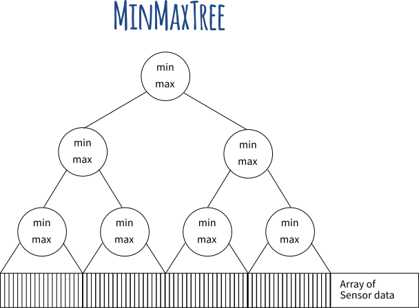

# [Waveform Graph for Large Datasets](https://www.kdab.com/a-speed-up-for-charting-on-embedded/)

When plotting large timeseries datasets, instead of drawing lines between every pair of consecutive data points in a typical line graph, a waveform graph draws each vertical pixel column as one line reaching from the minimum sample to the maximum sample.  
This requires much less lines to be drawn while presenting the same visual result as line graph.

## MinMaxTree Structure

A MinMaxTree structure summarizes ranges of data points in the underlying array. 

Each leaf node stores the minmax value of samples in range.

Parent nodes then store the minmax value of the combined range of its 2 children.

### Indexing

Infix indexing instead of array heap indexing for easier tree expansion. 
- **Left Child**: Find lowest set bit, unset it, and set the one-lower bit
- **Right Child**: Find lowest set bit and set the one-lower bit
- **Parent**: Find lowest set bit, unset it, and set the one-higher bit

### Updating the tree

Simple bubble up if minmax changed.

### Expanding the tree

1. double the trees size and mirror its current structure to extend its reach,
1. make a new root,
1. copy the data from the old root into the new root.

## Thoughts
Overwatch (Adaptation and Convergence as well maybe) could use this to query measurements across different ranges. 

This structure can allow our drill down/zoom in idea where the user may initially look at top level minmax node data and as he zooms in, the next level node minmax values are shown, etc.

We might want each parent node to have multiple children instead of a binary tree.  
For example, lowest layer of nodes are per hour minmax nodes, and 24 of these share a common parent representing minmax of a day, etc. This produces more human readable query ranges, but requires different indexing.